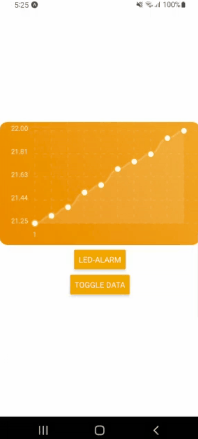

# iot-task0

## **Team 16**

**Team Members:-**

| Name      | Sec | BN     |
| :---        |    :----:   |          ---: |
| Alaa Seif elnasr Ibrahim | 1       | 11   |
| Habiba Mahmoud           | 1       | 25   |
| Hasan Hosni              | 1       | 26   |
| Mariam Glal Mohamad      | 2       | 24   |

## Task 0 discribtion
Introduction: ESP chip is a microcontroller chip with a wireless module ready for wireless communication. Use this chip to develop the below requirements:
1. Connect any two sensors (e.g. temperature and pressure) to the ESP.
2. The sensors readings should be transferred through WiFi to some server and saved in real time into some sql database on that server.
3. On the server, there should be a small application that sends control wireless signals to the ESP. For ex, a click on a button to toggle the data acquisition between pressure and temperature. Or, a click on a button to raise an alarm led connected to the ESP
4. The saved data on this server can be visualized on either a desktop software (might well be the server itself), or mobile app (feel free to choose which mobile OS you like to use). So in brief, I need to see the signal drawn and updated on some graph on a computer screen or mobile screen.
Note: The above "or" is for the user/customer, not the developer (i.e. YOU!). For the developer, this  "or" option means it's an  "and". i.e. you need to develop both features.
5. Instead of hard-coding the wifi connection info in the ESP code, give the user the flexibility to choose which wireless network s/he wants to connect to. i.e. show the user the surrounding wireless network names and he can choose one of them to connect to. You can view the names on either a small LCD or even on the ESP serial port.

